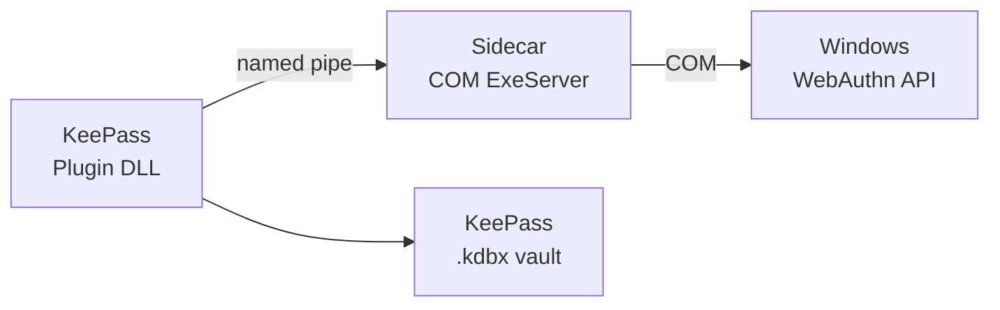

# KeePassKeyWin — Distribution Guide

## Architecture

KeePassKeyWin ships as **two separate artifacts** that both must be installed:

| Artifact | Format | Install target | Purpose |
|----------|--------|----------------|---------|
| `KeePassKeyWin.Provider.msix` | MSIX (Authenticode-signed) | Windows Apps | COM ExeServer — enables KeePassKeyWin as a Windows WebAuthn passkey provider |
| `KeePassKeyWin.Plugin.zip` | Zip archive | KeePass `Plugins/` dir | KeePass plugin — passkey vault, named-pipe IPC server, UV dialog |

The two-process architecture means each artifact is installed independently:



The plugin talks to the sidecar over a named pipe; the sidecar talks to Windows over COM. Neither works without the other.

## Code signing

The MSIX is Authenticode-signed via **SignPath Foundation** (free OSS code signing program).
The certificate is issued to SignPath Foundation, not to the project maintainer — the signed
MSIX chains to a Microsoft Trusted Root Program CA and bypasses SmartScreen.

GPG detached signatures (`.sig` files) for both artifacts are provided on the GitHub release
page as a cross-platform integrity check. Verify with:

```sh
gpg --verify KeePassKeyWin.Provider.msix.sig KeePassKeyWin.Provider.msix
gpg --verify KeePassKeyWin.Plugin.zip.sig KeePassKeyWin.Plugin.zip
```

The signing key is available at `keyserver.ubuntu.com` — search for
`KeePassKeyWin Releases`.

## User installation

### Prerequisites

- Windows 11 24H2 build 26100.6725 or later
- [KeePass 2.x](https://keepass.info/download.html)
- PowerShell 5.1+

### Steps

1. **Download** both artifacts from the [latest release](https://github.com/anomalyco/KeePassKeyWin/releases).

2. **Install the MSIX**
   ```powershell
   Add-AppxPackage -Path KeePassKeyWin.Provider.msix
   ```
   No admin rights needed — MSIX is per-user. No SmartScreen prompt if the MSIX
   is Authenticode-signed via SignPath.

3. **Register the provider with Windows**
   ```powershell
   # Find the install location
   $pkg = Get-AppxPackage -Name KeePassKeyWin.Provider
   $exe = Join-Path $pkg.InstallLocation "keepasskeywin-provider.exe"
   & $exe register
   ```
   This calls `WebAuthNPluginAddAuthenticator` to tell Windows about the provider.
   You can verify in *Settings → Accounts → Passkeys → Advanced options*.

4. **Install the plugin**
   - Locate your KeePass installation (default: `C:\Program Files\KeePass Password Safe 2`)
   - Extract `KeePassKeyWin.Plugin.zip` into the `Plugins\` subdirectory
   - Restart KeePass
   - Verify the plugin loaded: *Tools → KeePassKeyWin → About* shows OS version check status

5. **Create a passkey**
   - Go to a WebAuthn-enabled site (e.g. [webauthn.io](https://webauthn.io))
   - Choose "Create a new credential" — the Windows passkey picker appears
   - KeePassKeyWin should be listed as a passkey provider
   - Complete Windows Hello verification
   - The credential is saved to your KeePass vault

### Uninstall

```powershell
# Unregister the provider
$pkg = Get-AppxPackage -Name KeePassKeyWin.Provider
$exe = Join-Path $pkg.InstallLocation "keepasskeywin-provider.exe"
& $exe unregister

# Remove the MSIX
Remove-AppxPackage -Package $pkg.PackageFullName

# Remove the plugin DLLs from KeePass\Plugins\
Remove-Item "$env:ProgramFiles\KeePass Password Safe 2\Plugins\KeePassKeyWin.*.dll"
```

## Release process (maintainer)

### Prerequisites

Before the first release, complete these setup steps once:

1. **Apply to SignPath Foundation** at <https://signpath.io/product/open-source>
   - Approval takes 1–3 business days
   - You need: GitHub repo URL, project description, reason (SmartScreen for MSIX)

2. **Configure SignPath dashboard** after approval:
   - Create project `keepasskeywin`, link GitHub repo
   - Create signing policy `release-signing`, restrict to `master` and `release/*` branches
   - Add artifact configuration: `.signpath/artifact-configurations/default.xml` from this repo
   - Link Trusted Build System: GitHub.com
   - Generate an API token for a user with submitter permissions

3. **Add GitHub repository secrets**:
   - `SIGNPATH_API_TOKEN` — the token from step 2
   - `SIGNPATH_ORGANIZATION_ID` — visible in the SignPath dashboard (click org name in top-right)

4. **Update `Package.appxmanifest`** with the correct `@Publisher` value (see
   `docs/PLAN.md` § Open-source readiness — MSIX publisher subject placeholder).

### Making a release

```sh
# 1. Ensure master is up to date and CI passes
git checkout master
git pull

# 2. Tag the release
git tag v0.1.0
git push origin v0.1.0
```

This triggers the [`release.yml`](../.github/workflows/release.yml) workflow:

1. **`build-plugin`** (Windows runner) — compiles plugin DLLs, zips them, uploads as artifact
2. **`build-and-sign-msix`** (Windows runner) — builds the Rust sidecar, packs MSIX, uploads
   unsigned MSIX, submits to SignPath, downloads signed MSIX, uploads signed artifact
3. **Approval pause** — SignPath emails you with a signing request to review and approve
   in the SignPath dashboard
4. **`create-release`** (Ubuntu runner) — downloads both artifacts, creates GitHub Release
   with `gh release create`

After the release is created:

5. **GPG-sign the release assets manually** (the private key must not live in CI):
   ```sh
   gh release download v0.1.0
   for f in KeePassKeyWin.Provider.msix KeePassKeyWin.Plugin.zip; do
     gpg --detach-sign --armor "$f"
     gh release upload v0.1.0 "$f.asc"
   done
   ```

### SignPath approval

The workflow pauses at the SignPath signing step until you approve the request in the
SignPath dashboard. You'll receive an email notification. Approve via the dashboard link;
the CI job resumes automatically and downloads the signed MSIX.

Keep an eye on the time — the GitHub Actions job has a 6-hour timeout. The SignPath
approval step uses `wait-for-completion: true` and polls until the signed artifact
is ready (or the request is rejected).

## CI vs local builds

The release workflow builds the provider natively on a `windows-latest` runner
(no `cargo-xwin` cross-compile). This is different from the daily CI:

| Attribute | `ci.yml` (daily) | `release.yml` (tag) |
|-----------|------------------|---------------------|
| Runner | Ubuntu | Windows for MSIX |
| Rust build | `cargo xwin` (cross-compile) | `cargo build` (native) |
| MSIX | Not built | `makeappx pack` via `build-msix.ps1` |
| Signing | N/A | SignPath (free OSS) |
| Plugin DLL | Not built | `dotnet build -f net48 Release` |
| GitHub Release | N/A | Created with artifacts |
