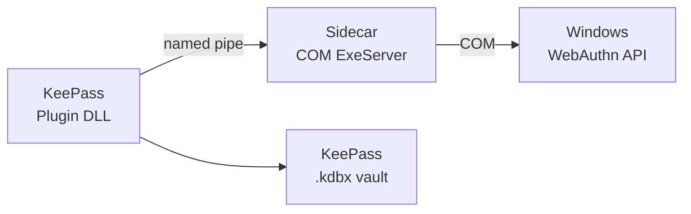

# KeePassKeyWin — Distribution Guide

## Architecture

KeePassKeyWin ships as **two separate artifacts** that both must be installed:

| Artifact | Format | Install target | Purpose |
|----------|--------|----------------|---------|
| `KeePassKeyWin.Provider.msix` | MSIX (Authenticode-signed) | Windows Apps | COM ExeServer — enables KeePassKeyWin as a Windows WebAuthn passkey provider |
| `KeePassKeyWin.Plugin.zip` | Zip archive | KeePass `Plugins/` dir | KeePass plugin — passkey vault, named-pipe IPC server, UV dialog |

The two-process architecture means each artifact is installed independently:



The plugin talks to the sidecar over a named pipe; the sidecar talks to Windows over COM. Neither works without the other.

## Code signing

The MSIX is Authenticode-signed with a **self-signed certificate** generated by the
project maintainer. The certificate is not issued by a public CA, so Windows will
show a SmartScreen warning and the MSIX will not be trusted until the certificate
is explicitly installed into the `LocalMachine\TrustedPeople` certificate store
(see [Self-signed certificate trust](#self-signed-certificate-trust)).

GPG detached signatures (`.sig` files) for both artifacts are provided on the GitHub release
page as a cross-platform integrity check. Verify with:

```sh
gpg --verify KeePassKeyWin.Provider.msix.sig KeePassKeyWin.Provider.msix
gpg --verify KeePassKeyWin.Plugin.zip.sig KeePassKeyWin.Plugin.zip
```

The signing key is available at `keyserver.ubuntu.com` — search for
`KeePassKeyWin Releases`.

## User installation

### Prerequisites

- Windows 11 24H2 build 26100.6725 or later
- [KeePass 2.x](https://keepass.info/download.html)
- PowerShell 5.1+

### Steps

1. **Download** both artifacts from the [latest release](https://github.com/anomalyco/KeePassKeyWin/releases).

2. **Install the MSIX**
   ```powershell
   Add-AppxPackage -Path KeePassKeyWin.Provider.msix
   ```
   No admin rights needed — MSIX is per-user. A SmartScreen warning may appear;
   see [Self-signed certificate trust](#self-signed-certificate-trust) to suppress it.

3. **Register the provider with Windows**
   ```powershell
   # Find the install location
   $pkg = Get-AppxPackage -Name KeePassKeyWin.Provider
   $exe = Join-Path $pkg.InstallLocation "keepasskeywin-provider.exe"
   & $exe register
   ```
   This calls `WebAuthNPluginAddAuthenticator` to tell Windows about the provider.
   You can verify in *Settings → Accounts → Passkeys → Advanced options*.

4. **Install the plugin**
   - Locate your KeePass installation (default: `C:\Program Files\KeePass Password Safe 2`)
   - Extract `KeePassKeyWin.Plugin.zip` into the `Plugins\` subdirectory
   - Restart KeePass
   - Verify the plugin loaded: *Tools → KeePassKeyWin → About* shows OS version check status

5. **Create a passkey**
   - Go to a WebAuthn-enabled site (e.g. [webauthn.io](https://webauthn.io))
   - Choose "Create a new credential" — the Windows passkey picker appears
   - KeePassKeyWin should be listed as a passkey provider
   - Complete Windows Hello verification
   - The credential is saved to your KeePass vault

### Uninstall

```powershell
# Unregister the provider
$pkg = Get-AppxPackage -Name KeePassKeyWin.Provider
$exe = Join-Path $pkg.InstallLocation "keepasskeywin-provider.exe"
& $exe unregister

# Remove the MSIX
Remove-AppxPackage -Package $pkg.PackageFullName

# Remove the plugin DLLs from KeePass\Plugins\
Remove-Item "$env:ProgramFiles\KeePass Password Safe 2\Plugins\KeePassKeyWin.*.dll"
```

## Self-signed certificate trust

The MSIX is signed with a self-signed certificate that Windows does not trust by
default. Before you can install the MSIX, you must install the certificate into
the `LocalMachine\TrustedPeople` store **once per certificate** (e.g. once per
release). This is a one-time step per development machine — subsequent releases
signed with the same certificate reuse the same trust.

```powershell
# Requires elevated (admin) PowerShell
$cert = Get-PfxCertificate -FilePath KeePassKeyWin.Dev.pfx
$store = New-Object System.Security.Cryptography.X509Certificates.X509Store(
    'TrustedPeople', 'LocalMachine'
)
$store.Open('ReadWrite')
$store.Add($cert)
$store.Close()
```

After installing the trust, install the MSIX normally:

```powershell
Add-AppxPackage -Path KeePassKeyWin.Provider.msix
```

The PFX file is distributed alongside the release (or obtained from the
project maintainer). If you skip this step, `Add-AppxPackage` will fail with
error `0x800B0109` (certificate chain not trusted).

## Release process (maintainer)

### Prerequisites

Before the first release, complete these setup steps once:

1. **Generate a self-signed code-signing certificate** on a Windows machine:
   ```powershell
   .\scripts\ensure-dev-cert.ps1
   ```
   This creates `out\KeePassKeyWin.Dev.pfx` (gitignored) in the repo root
   and installs the public half into `Cert:\LocalMachine\TrustedPeople`.

2. **Base64-encode the PFX** for storage as a GitHub secret:
   ```powershell
   [Convert]::ToBase64String([IO.File]::ReadAllBytes("$pwd\out\KeePassKeyWin.Dev.pfx")) | Set-Content out\cert-b64.txt
   ```

3. **Add GitHub repository secrets**:
   - `DEV_CERTIFICATE` — the base64-encoded PFX content from step 2
   - `DEV_CERTIFICATE_PASSWORD` — the PFX password you supplied to `ensure-dev-cert.ps1`

4. **Update `Package.appxmanifest`** with the correct `@Publisher` value (see
   `docs/PLAN.md` § Open-source readiness — MSIX publisher subject placeholder).
   The Subject of the self-signed certificate must match the Publisher attribute
   exactly (`sign-msix.ps1` validates this at signing time).

### Making a release

```sh
# 1. Ensure master is up to date and CI passes
git checkout master
git pull

# 2. Tag the release
git tag v0.1.0
git push origin v0.1.0
```

This triggers the [`release.yml`](../.github/workflows/release.yml) workflow:

1. **`build-plugin`** (Windows runner) — compiles plugin DLLs, zips them, uploads as artifact
2. **`build-and-sign-msix`** (Windows runner) — builds the Rust sidecar, packs MSIX, signs
   it with the self-signed certificate from the `DEV_CERTIFICATE` secret, uploads the signed
   MSIX artifact
3. **`create-release`** (Ubuntu runner) — downloads both artifacts, creates GitHub Release
   with `gh release create`

After the release is created:

4. **GPG-sign the release assets manually** (the private key must not live in CI):
   ```sh
   gh release download v0.1.0
   for f in KeePassKeyWin.Provider.msix KeePassKeyWin.Plugin.zip; do
     gpg --detach-sign --armor "$f"
     gh release upload v0.1.0 "$f.asc"
   done
   ```

No external approval is needed — CI decodes the PFX from the secret and signs the
MSIX directly using `scripts/sign-msix.ps1`. The signing step completes in seconds
and does not require manual intervention.

## CI vs local builds

The release workflow builds the provider natively on a `windows-latest` runner
(no `cargo-xwin` cross-compile). This is different from the daily CI:

| Attribute | `ci.yml` (daily) | `release.yml` (tag) |
|-----------|------------------|---------------------|
| Runner | Ubuntu | Windows for MSIX |
| Rust build | `cargo xwin` (cross-compile) | `cargo build` (native) |
| MSIX | Not built | `makeappx pack` via `build-msix.ps1` |
| Signing | N/A | Self-signed cert |
| Plugin DLL | Not built | `dotnet build -f net48 Release` |
| GitHub Release | N/A | Created with artifacts |
